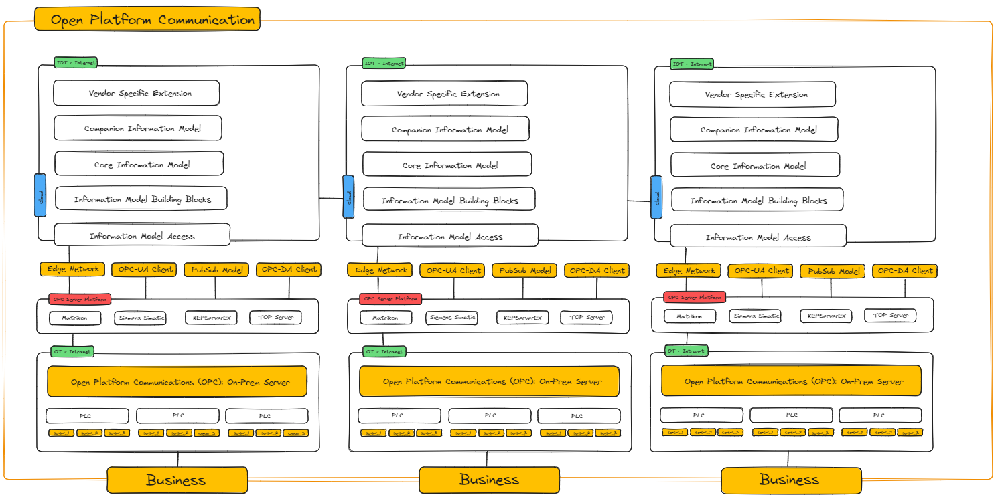

# Awesome OPC Python Resource

This repository contains a curated list of resources and tools for working with OPC (Open Platform Communications) in Python. Whether you're developing OPC servers, clients, or exploring OPC-related libraries, this collection aims to provide valuable insights and guidance for your Python OPC projects.

## Background

OPC is a set of communication standards used in industrial automation and process control. It enables interoperability between devices and applications from different vendors, facilitating seamless data exchange and real-time control. OPC UA (Unified Architecture) is the modern and platform-independent version of OPC, designed for enhanced security, scalability, and flexibility.

## Architecture

The OPC architecture consists of many components from sensors to cloud infrastructor covering OT and IOT technologies, the following image showcases some of the basic components that architects an OPC. They are also listed below:

- OPC Server
    - Progammable Logic Contorllers
        - Sensor Configuration
- OPC Server Platforms
    - Matrikon
    - KEPServerEx
    - TOP Server
    - Siemens Simatic
- OPC Clients
    - UA Clients
    - DA Clients
- Edge Networks
- PubSub Model
- Cloud Integration

- OPC Server: The OPC server acts as a data provider, exposing process and control data from industrial devices and systems. It serves data through OPC interfaces, making it accessible to OPC clients.
- OPC Client: The OPC client is an application that consumes data from OPC servers. It uses OPC interfaces to browse, read, and write data to the connected OPC servers.

## Getting Started

If you are new to OPC development in Python, you can start by exploring the following resources:
- OPC UA Specification - The official OPC UA specification provided by the OPC Foundation.
- Python OPC UA Documentation - Documentation for the Python OPC UA library, which allows you to develop OPC UA servers and clients.

## Server

### Implementing OPC UA Server
Python OPC UA Server Example - A step-by-step tutorial on creating an OPC UA server in Python using the python-opcua library.

### OPC Classic Server
Python OPC Classic Server Example - A guide on building an OPC Classic server in Python with the opc-ua library.

## Client

### Implementing OPC UA Client
Python OPC UA Client Example - Learn how to create an OPC UA client in Python using the python-opcua library.

### OPC Classic Client

Python OPC Classic Client Example - A tutorial on developing an OPC Classic client in Python using the opc-ua library.

## Libraries
- python-opcua - A popular Python library for implementing OPC UA servers and clients.
- opc-ua - An alternative OPC UA library for Python with a focus on simplicity and ease of use.

## Additional Resources
- OPC Foundation - The official website of the OPC Foundation, where you can find the latest OPC specifications and information.

## Contribution
If you have any suggestions or want to add resources to this list, feel free to submit a pull request. We welcome contributions from the OPC community to keep this resource up-to-date and valuable.

## License
This repository is licensed under the MIT License. Feel free to use and share the information provided here in accordance with the license terms.
