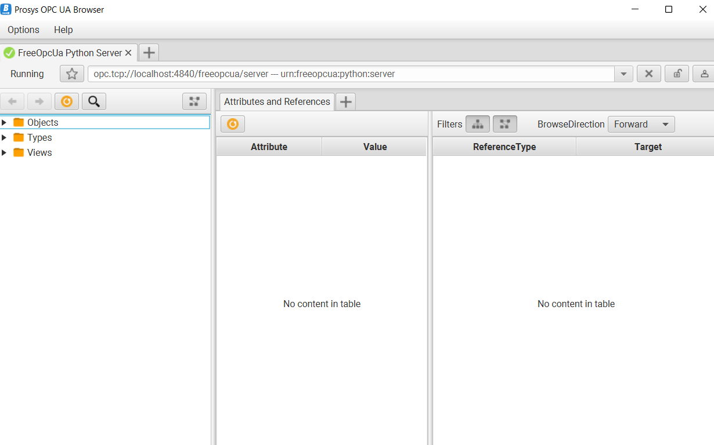

# How to Setup a OPC server Locally

Setting up a complete OPC UA server requires more than just a code snippet, as it involves installing and configuring various dependencies. However, I can guide you through the steps and provide you with a basic example using the `FreeOpcUa` library to create a simple OPC UA server locally using VS Code and Python.

Here's a basic outline of the steps you need to follow:

1. **Install Required Packages:**
   Open a terminal in VS Code and install the `FreeOpcUa` library using the following command:
   
   ```bash
   pip install FreeOpcUa
   ```

2. **Write the OPC UA Server Code:**
   Create a Python script, for example, `opc_server.py`, and add the following code:

```python
from opcua import Server

if __name__ == "__main__":
    # Create a server instance
    server = Server()

    # Setup server endpoint
    server.set_endpoint("opc.tcp://localhost:4840/freeopcua/server/")

    # Setup server namespace
    uri = "http://example.org"
    idx = server.register_namespace(uri)

    # Create a new object under the root
    objects = server.nodes.objects
    myobj = objects.add_object(idx, "MyObject")

    # Add a variable to the object
    myvar = myobj.add_variable(idx, "MyVariable", 0)
    myvar.set_writable()

    # Start the server
    server.start()
    
    try:
        while True:
            pass
    finally:
        # Stop the server on exit
        server.stop()
```

3. **Run the OPC UA Server:**
   Open a terminal in VS Code and run the script:
   ```
   python opc_server.py
   ```

4. **Access the Server:**
   You can now access your local OPC UA server using any OPC UA client. You can use tools like UaExpert, Prosys OPC UA Client, or even your own Python client code.

Keep in mind that this is a very basic example. In a real-world scenario, you would add more complex objects, variables, and methods to your server, as well as implement proper error handling and security measures.

Please note that the `FreeOpcUa` library is just one option for creating an OPC UA server in Python. There are other libraries like `asyncua` that provide more advanced features and asynchronous capabilities. Additionally, setting up a complete production-level OPC UA server might involve more configurations and considerations, such as security settings, user authentication, and certificates.

5. **Result:**

    I'm using the Prosys OPC UA Browser software to login as a client in the server created above. Following is my running opc-server.

